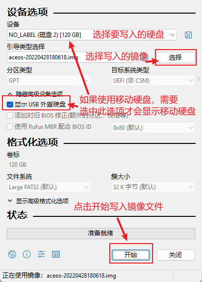
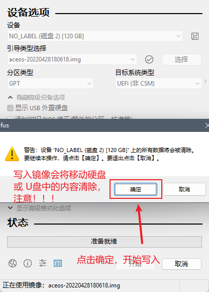
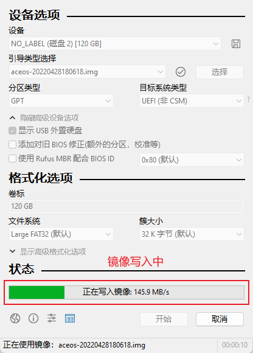
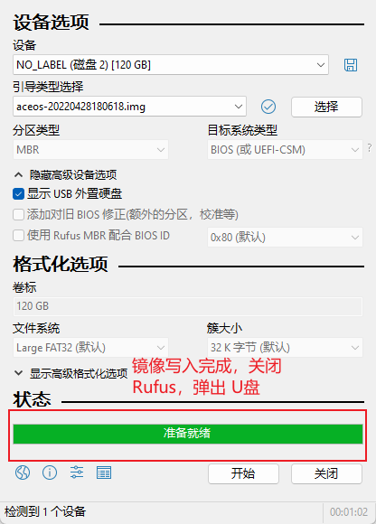
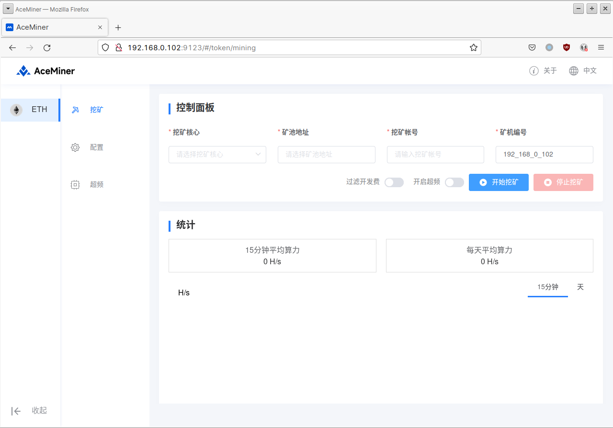

# AceMiner挖矿教程

## AceOS

AceOS 是针对 AceMiner 的定制系统，基于 Ubuntu LTS 20.04，集成 Amd 和 Nvidia 显卡驱动。

### 下载

AceOS 以磁盘镜像格式发布，安装时使⽤镜像烧录工具将下载的镜像烧录到 U 盘或者移动硬盘， 然后将 U 盘插⼊机器，启动即可。

[下载最新版本的AceOS](https://kldl.oss-accelerate.aliyuncs.com/aceos/dl/aceos-20220520192504.img.xz)

[下载镜像烧录软件Rufus](https://kldl.oss-accelerate.aliyuncs.com/aceos/dl/rufus-3.18p.exe)

### 制作U盘镜像

下载镜像文件并解压

.png>)

将下载的镜像压缩包解压为img格式文件

#### 使用Rufus

下载Rufus，然后双击启动，不需要安装。如果系统开启了【用户账户控制】，启动时会弹出提示框确认是否允许rufus控制系统，选择【是】。

<figure><figcaption></figcaption></figure>


如图配置 rufus，操作如下:

1. 选择要写⼊的U盘或者移动硬盘
2. 选择解压出的系统镜像
3. 点击【开始】按钮，开始写⼊操作



开始写⼊时会弹出警告提⽰，写⼊镜像会清空 U 盘或者移动硬盘中的内容，请注意备份 U 盘或移 动硬盘中原有⽂件。



开始写⼊操作后，可以通过进度条查看写⼊进度。



写⼊完成后，rufus 会提⽰准备就绪，此时可以关闭 rufus，并且弹出 U 盘，然后将 U 盘插⼊需要 启动的机器上，从 U 盘启动系统。



### 启动AceOS

镜像成功写⼊U盘后，就可以将 U 盘插⼊机器启动，启动时需要注意:

1. 需要设置系统 BIOS 从 UEFI 启动
2. 需要设置系统的启动顺序，优先从写⼊镜像的 U盘启动

## AceMiner

AceMiner 是集成化的矿机管理工具，内置 Ethminer、NBMiner， Phoenix Miner 等挖矿软件， ⽀持单机挖矿，并且⽀持群控。

### 下载

AceMiner 分为两个版本，单机版和群控版。矿机需要安装单机版，如果矿机数量少，可以直接使 ⽤单机版的配置功能管理和控制矿机，如果矿机数量多，可以在控制电脑上安装群控版，批量配置 和管理矿机。

[Linux单机版](https://kldl.oss-accelerate.aliyuncs.com/aceminer/dl/AceMiner-2.1.0-amd64-linux-standard.deb)

[Linux群控版](https://kldl.oss-accelerate.aliyuncs.com/aceminer/dl/AceMiner-2.1.0-amd64-linux-cluster.deb)

[Windows群控版](https://kldl.oss-accelerate.aliyuncs.com/aceminer/dl/AceMiner-2.1.0-win32-cluster.exe)

[MacOS群控版-Inter](https://kldl.oss-accelerate.aliyuncs.com/aceminer/dl/AceMiner-2.1.0-osx-cluster-x64.dmg)

[MacOS群控版-M1](https://kldl.oss-accelerate.aliyuncs.com/aceminer/dl/AceMiner-2.1.0-osx-cluster-arm64.dmg)

### 单机版

AceMiner 单机版可以单独安装在矿机上，针对单台矿机设置、挖矿，同时也是群控版的客⼾端， 可以通过群控版在局域⽹中被群控。

#### 安装

安装前需要注意以下内容:&#x20;

• 如果使⽤ AceOS， AceOS 已经内置 AceMiner，不需要再安装。

&#x20;• AceMiner 单机版⽬前仅⽀持 Linux 系统 (Ubuntu 20.04)。&#x20;

• 如果⾮ AceOS 安装 AceMiner，请确保显卡驱动已经安装，并且显卡可⽤，并且确保 nvidia-smi (N卡) 和 rocm-smi (A卡) 可⽤。

#### Linux系统

```
# 下载deb包
wget https://kldl.oss-accelerate.aliyuncs.com/aceminer/dl/AceMiner-latest-amd64-
linux-standard.deb

# 或使用curl下载
# curl -L https://kldl.oss-accelerate.aliyuncs.com/aceminer/dl/AceMiner-latestamd64-linux-standard.deb \
# -O ./AceMiner-latest-amd64-linux-standard.deb

# 安装下载的deb包
sudo apt install ./AceMiner-latest-amd64-linux-standard.deb
```

#### 打开AceMiner

进⼊ AceMiner 单机版的控制⻚⾯有两种⽅式：&#x20;

单独安装 AceMiner，：可以在系统菜单中看到 AceMiner，可以直接打开 AceMiner。

使⽤ AceOS：可以在系统桌⾯空⽩处右键打开菜单，可以在菜单中看到 AceMiner ⼊⼝，点击即可 打开

<figure><figcaption></figcaption></figure>

如果不⽅便直接操作矿机，可以通过与矿机同⼀局域⽹的其他电脑的浏览器，使⽤地址 http://<矿机 ip>:9123 打开浏览器，⽐如矿机 ip 地址是 192.168.0.2 ， 可以使⽤地址http://192.168.0.2：9123

#### 一、挖矿功能

直接打开 AceMiner 和使⽤浏览器控制 AceMiner 的操作⽅式相同。

⾸先，需要在设置⻚⾯配置挖矿相关的参数

* 【挖矿核⼼】AceMiner ⽀持不同的挖矿软件，针对当前币种，可以选择想要使⽤的挖矿软 件&#x20;
* 【矿池地址】填⼊想要使⽤的矿池对应币种的挖矿地址&#x20;
* 【挖矿账号】填⼊所在矿池的挖矿账号，对于⽀持匿名挖矿的矿池，可以填⼊钱包地址&#x20;
* 【矿机编号】矿机编号，默认为 IP 地址，可以修改&#x20;
* 【过滤开发费】开启此选项后，会⾃禁⽌挖矿软件与矿池连接之外的所有⽹络连接&#x20;
* 【开启超频】使⽤显卡超频，需要提前[设置超频模板](aceminer-wa-kuang-jiao-cheng.md#san-chao-pin)

<figure><figcaption></figcaption></figure>

#### 二、系统设置

分时模式启用后，您可控制AceMiner在指定的时间段进行挖矿，便于灵活控制挖矿周期。

<figure><figcaption></figcaption></figure>

#### 三、设置超频模版

可自定义超频模版，用于矿机超频。开启超频后，挖矿效率会有一些提高，但同时可能影响显卡寿命，请谨慎操作。

<figure><figcaption></figcaption></figure>

#### 四、算力统计

* 开始挖矿后系统按15分钟、天统自动统计力曲线，便于用户追踪矿机算力状态。
* 点击分钟、小时、天选项卡可以刷新最新的矿机算力状态。

<figure><figcaption></figcaption></figure>

#### 五、自动更新

启用自动更新后，系统将每隔一段时间自动检查版本，若发现新版本将会自动更新。

<figure><figcaption></figcaption></figure>

