# HiveOS挖矿教程

**以ETC为例讲解如何通过hiveOS连接可乐矿池实现挖矿**

因可乐矿池服务器在国外，因此挖矿时需使用矿梯帮助矿机访问矿池，具体教程查看[矿梯使用教程](../ladder.md)

**第一步：创建飞行表**

1.登录hiveos，点击**飞行表**

<figure>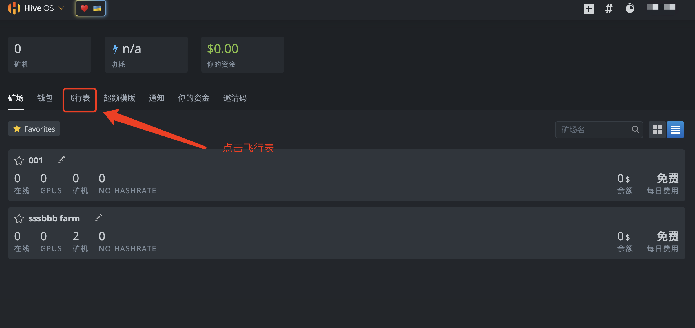<figcaption>
<strong>点击飞行表</strong>
</figcaption></figure>

2.添加新的飞行表，选择数字货币ETC，钱包（若没有需新增），矿池，挖矿软件，名称

<figure>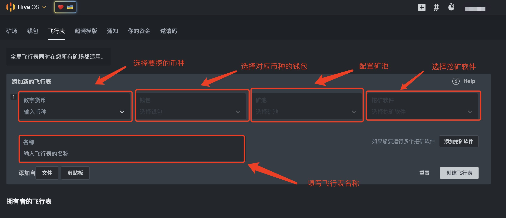<figcaption>
添加飞行表
</figcaption></figure>

**数字货币：**选择您要挖的货币

**钱包：**选择您设置好的所挖币种的钱包，若没有需添加钱包；

**矿池：**选择hiveos，输入矿池地址，点击应用；

_可进入_[_**可乐矿池**_](https://app.gitbook.com/u/lceIzXFoyeO562G5euxcKj3yl7Z2)_官网首页查找各币种挖矿地址_

_若使用矿梯，此处地址填写矿梯种配置好的IP地址，_[_**矿梯使用教程**_](../ladder.md)__

**挖矿软件：**根据您的矿机选择不同挖矿软件；

**飞行表名称：**填写飞行表名称；

<figure>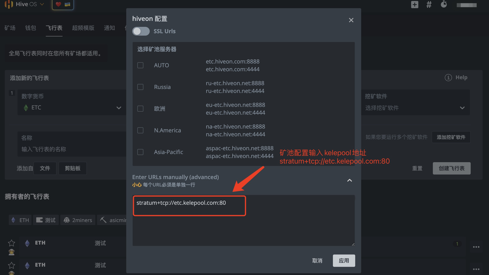<figcaption>
配置矿池地址
</figcaption></figure>

<figure>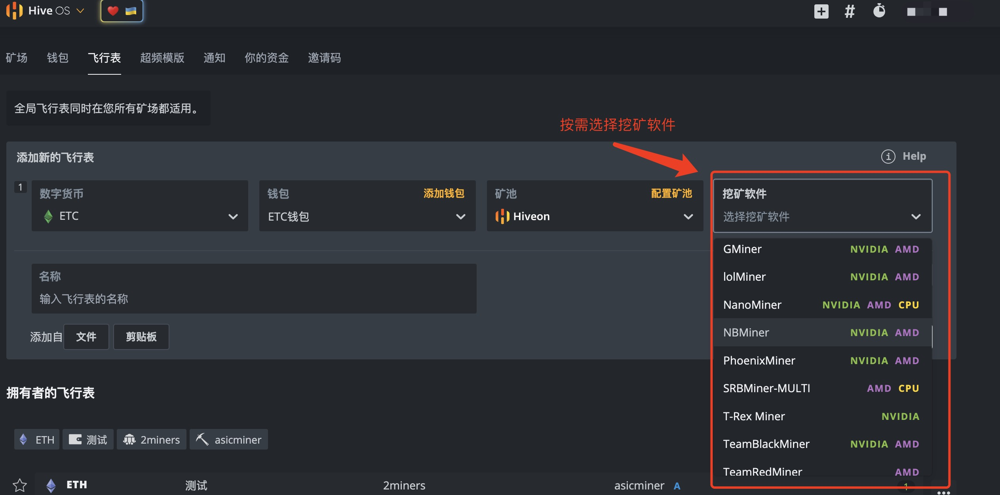<figcaption>
选择挖矿软件
</figcaption></figure>

<figure><figcaption>
创建飞行表
</figcaption></figure>

飞行表创建成功

<figure>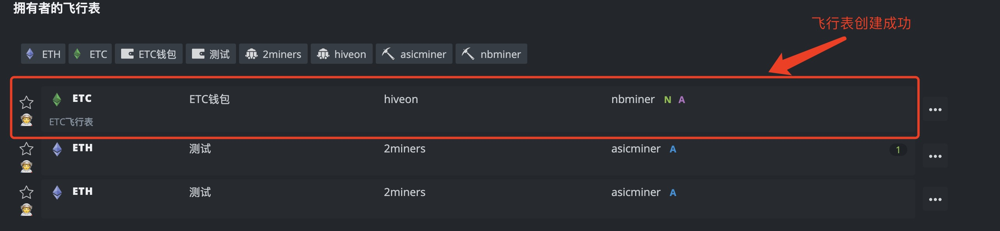<figcaption></figcaption></figure>

**第二步：配置矿机**

1.点击矿场，选择矿机

<figure>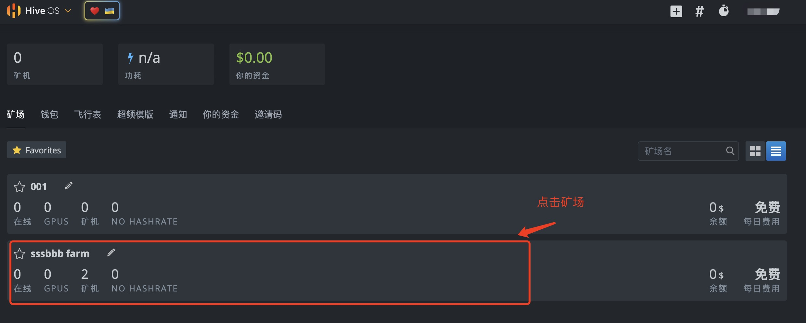<figcaption>
 点击矿场
</figcaption></figure>

<figure>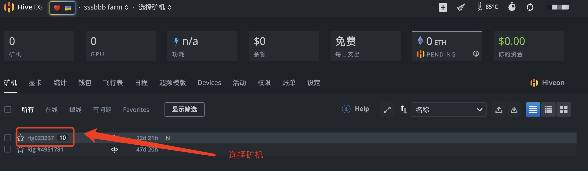<figcaption>
选择矿机
</figcaption></figure>

2.进入矿机详情，点击飞行表，再次点击飞行表图标

<figure>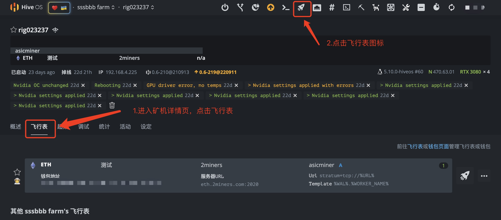<figcaption>
选择飞行表
</figcaption></figure>

<figure>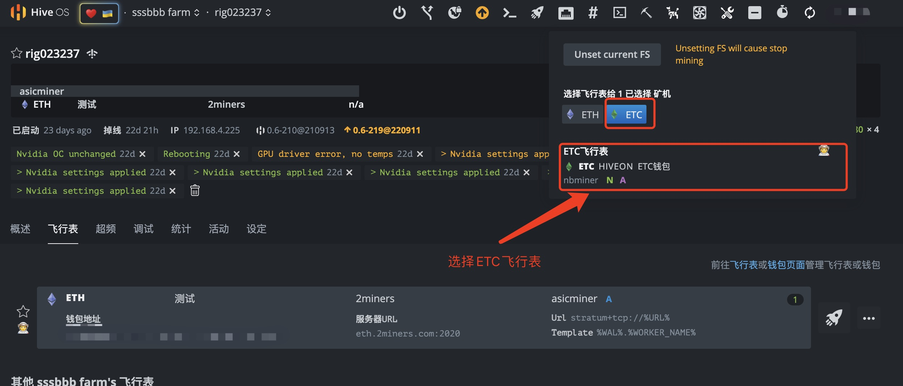<figcaption>
为矿机配置飞行表
</figcaption></figure>

3.选择新增的 **ETC挖矿飞行表，**点击**应用**

<figure>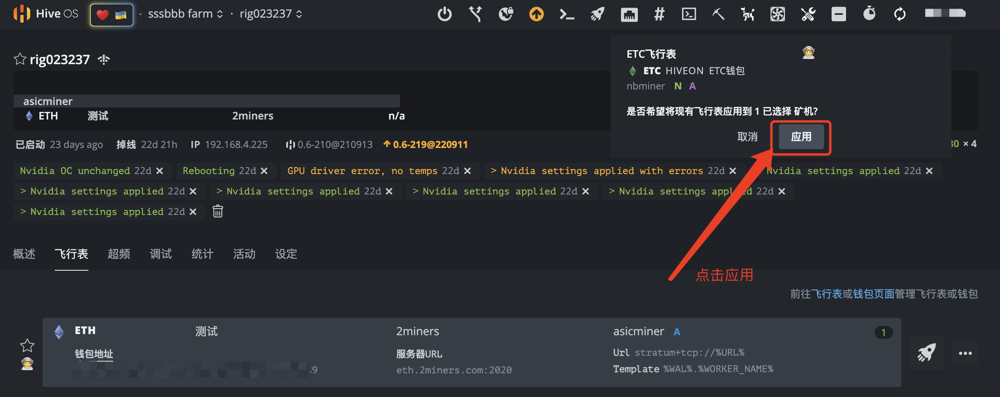<figcaption>
点击应用
</figcaption></figure>

4.设置完成

<figure>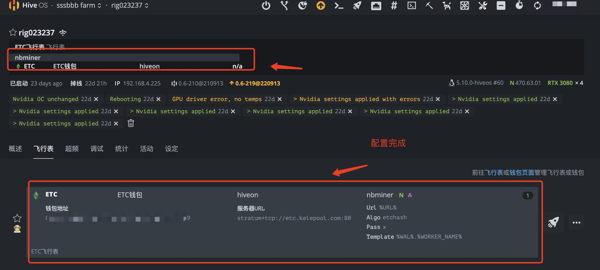<figcaption>
设置完成
</figcaption></figure>
